# Gerenciamento de Compras

## Purchasing management

o projeto se trata de um gerenciador de compras com algumas funcionalidades para auxiliar a loja, com funcionalidades personalizadas para o cliente.

<h1 align="center">
    <a href="https://buy-management.web.app/">🔗 Purchasing management</a>
</h1>

🚀 Obs: Sem permissão para incluir dados, e-mails desconhecidos com acesso somente de leitura.

 

Um demonstrativo sobre o projeto:

 
<strong>Página inicial - Login:</strong>
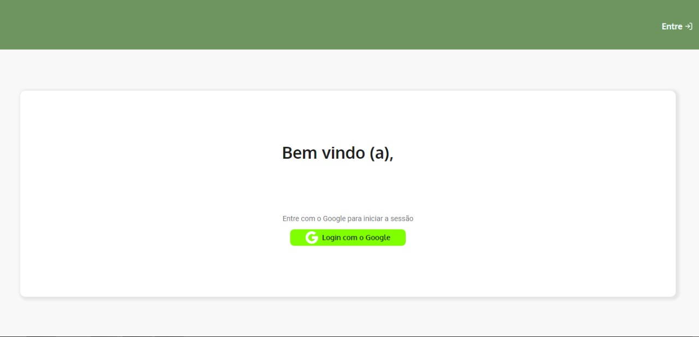

<strong>Criação do Pedido:</strong>
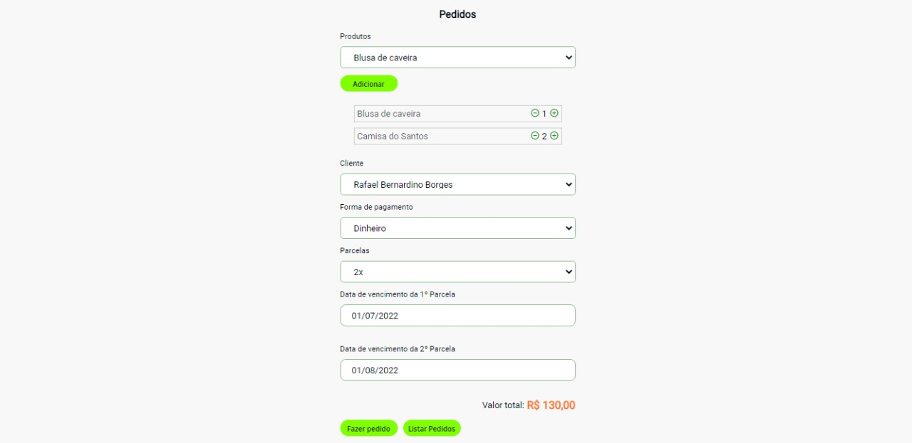

<strong>Criação do Produto:</strong>
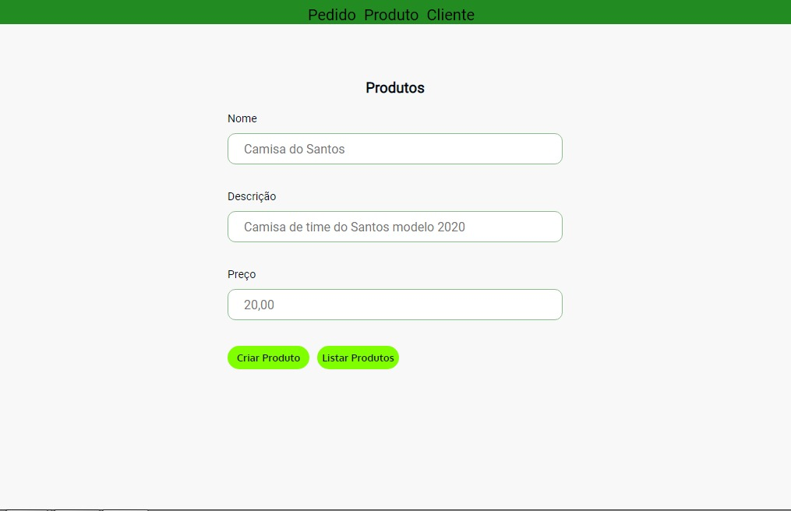

<strong>Lista do Clientes:</strong>
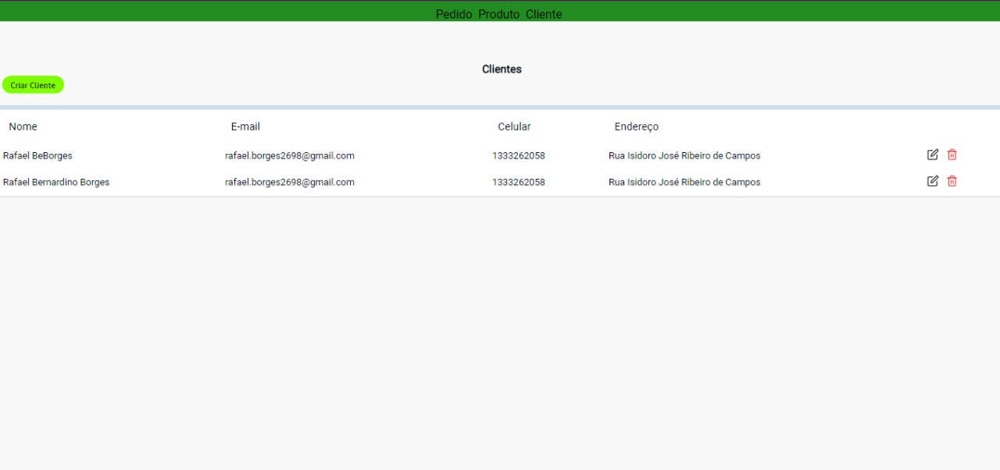

<strong>Atualizar o Produto:</strong>
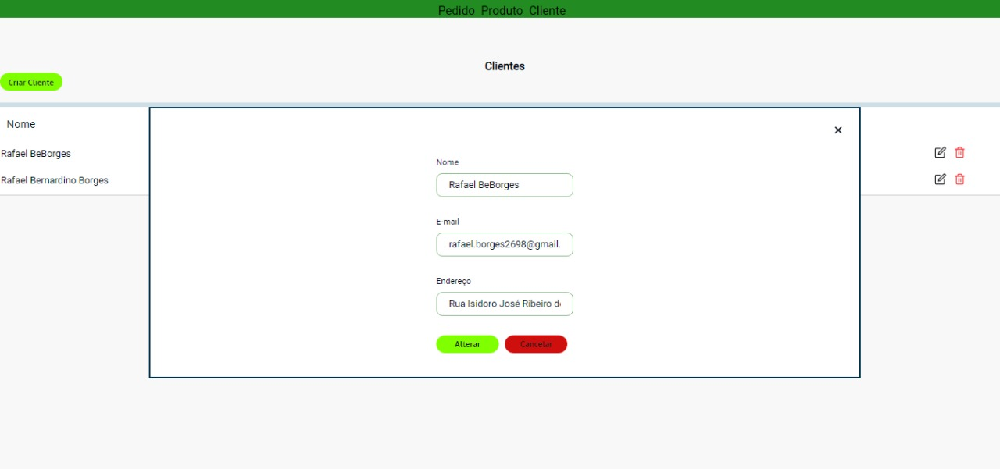

<strong>Atualizar o Pedido:</strong>
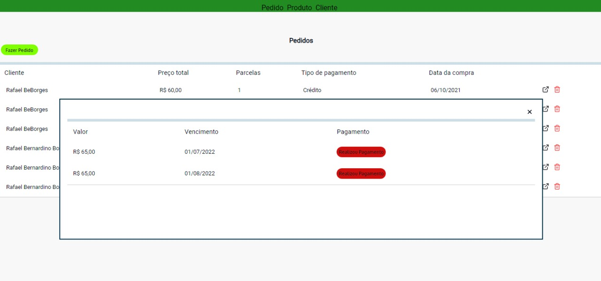

<h4>Tela responsiva:</h4>
 

<strong>Página Inicial - Login:</strong> 
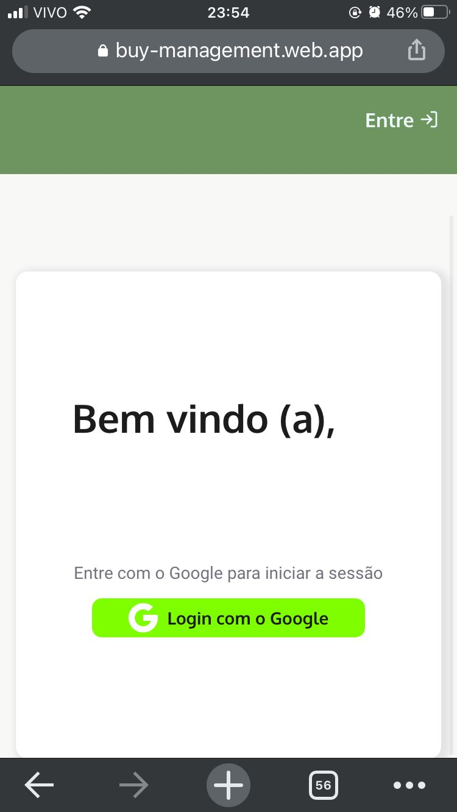

<strong>Criação de Produtos:</strong> 
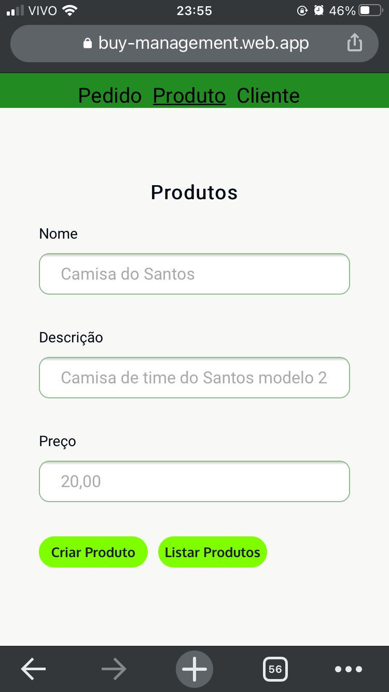

<strong>Criação de Pedidos:</strong> 
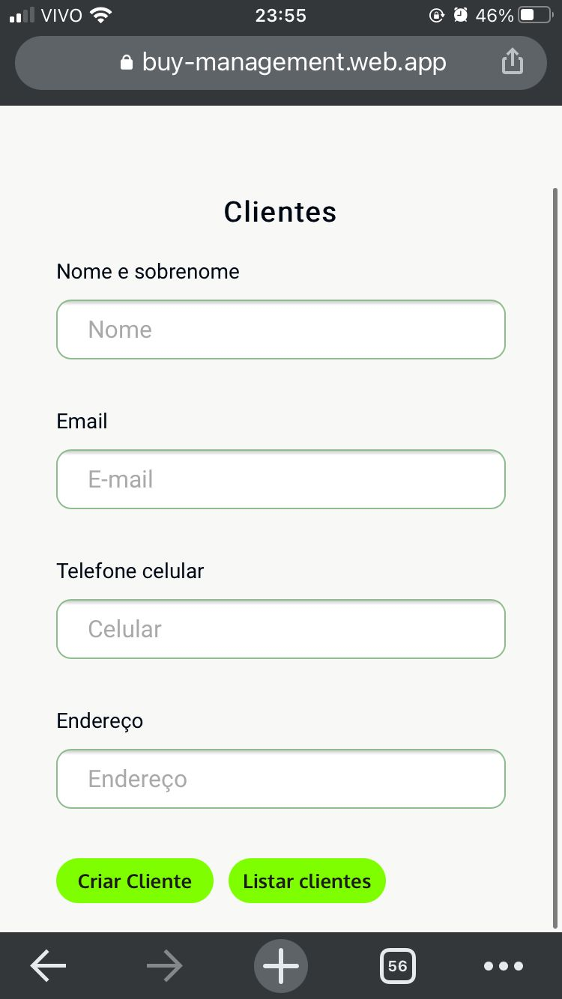

<strong>Criação de Clientes:</strong> 

<strong>Lista de Pedidos:</strong> 
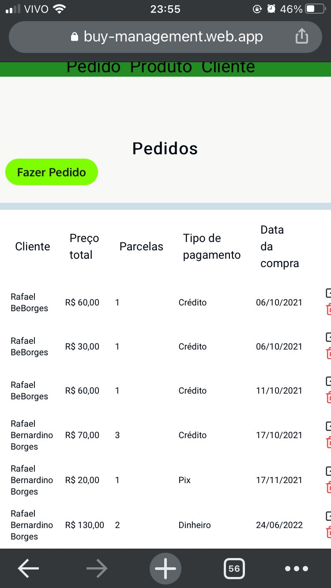

<strong>Atualizar os pedidos:</strong> 
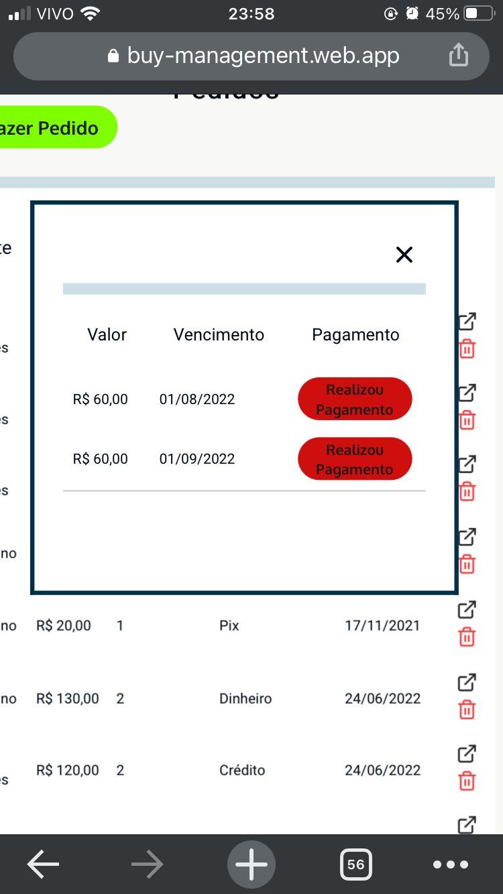

### 🛠 Tecnologias

As seguintes ferramentas foram usadas na construção do projeto:

- [Firebase](https://firebase.google.com/)
- [React](https://pt-br.reactjs.org/)
- [TypeScript](https://www.typescriptlang.org/)

 
  
 <b>Rafael</b></a>

Feito por Rafael Borges 👋🏽 Entre em contato!

 

